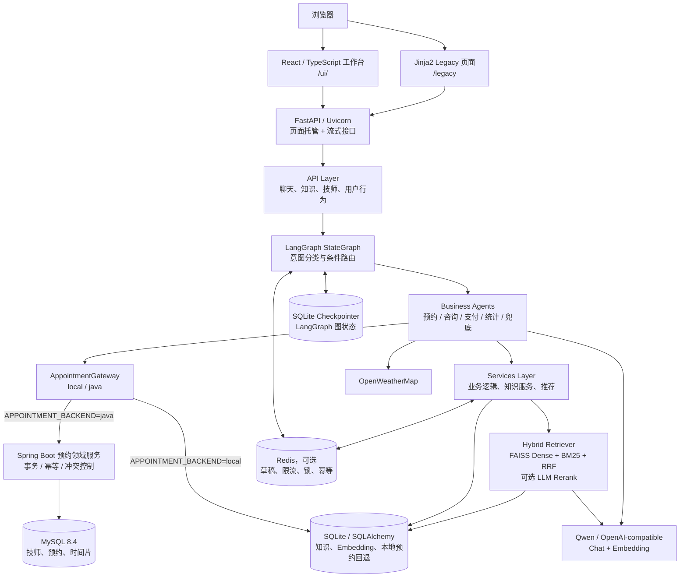

# Smart Appointment AI Agent

一个面向按摩门店场景的智能预约与咨询系统。React 工作台通过 FastAPI 流式接口连接 LangGraph 多 Agent，完成预约、咨询、支付确认和服务统计；知识问答采用 Dense + BM25 + RRF 的 Hybrid RAG。确定性的预约交易通过 `AppointmentGateway` 解耦到 Spring Boot + MySQL，由数据库事务、幂等键和唯一时间片约束保证并发正确性。

[](https://github.com/zzzys123/smart-appointment-ai-agent/actions/workflows/ci.yml)

---

## 核心特性

- **多 Agent 协作**：任务分类 → 预约 / 咨询 / 支付 / 统计 / 无关处理，5 类意图全覆盖
- **LangGraph 编排**：用 StateGraph 替代手写状态机，分类与业务节点的路由关系集中定义
- **混合检索 RAG**：Dense 向量（FAISS + Qwen Embedding）+ BM25 稀疏（jieba 分词）双路召回，RRF 融合，兼顾语义匹配与专有名词/数字精确匹配
- **动态精排**：高置信查询直出 Hybrid，歧义/边界问题按策略进入 Cross-Encoder 或 LLM；支持分数融合、超时回退
- **可插拔检索器**：`BaseRetriever` 抽象（工厂 + 模板方法），`dense` / `hybrid` 策略通过配置一键切换，零代码改动，新增策略只需实现两个方法
- **链路可观测**：检索全链路 Trace，记录 dense / sparse / RRF / rerank、路由原因、证据门和融合分；支持隐私安全 JSONL 与失败归档
- **证据约束与引用**：使用 Dense/BM25 原始分阈值触发无答案兜底，回答后展示来源、章节和分块编号
- **Structured Output**：用 `with_structured_output` + Pydantic Schema 约束预约字段，并由业务代码继续做值校验与标准化
- **会话状态管理**：AsyncSqliteSaver 持久化 LangGraph 图状态；启用 Redis 后可共享预约草稿并提供 TTL
- **Java 预约领域服务**：Python 负责自然语言理解和 Agent 编排，Spring Boot 负责技师档期、预约事务、幂等与最终冲突裁决
- **数据库并发防线**：MySQL 唯一时间片约束保证同一技师同一时段最多一个预约，Testcontainers 验证真实并发和事务回滚
- **多用户隔离**：`thread_id` 机制，不同用户的对话状态完全独立
- **Redis 协调**：共享预约草稿、会话级限流、分布式锁与幂等键，支持多进程部署
- **量化评估**：50 条严格证据 + 10 条无答案用例；覆盖检索、端到端回答、忠实度、引用、拒答和安全边界

---

## 当前工程基线（2026-08-23）

| 项目 | 当前状态 |
|------|---------|
| 知识基线 | 90 条活动知识：10 条内置知识 + 10 篇受管文档生成的 80 个分块 |
| Golden 版本 | Golden v2 已冻结；40 条 Dev + 20 条 Holdout，正式基线均为 100%，不以日常反复跑 60/60 为目标 |
| 默认检索 | Hybrid（Dense + BM25 + RRF）；Cross-Encoder 与 LLM 精排可按策略启用 |
| 自动化测试 | Python 98 条确定性测试通过、15 条在线模型测试跳过；Java 19 条测试通过，含 4 条真实 MySQL Testcontainers 集成测试 |
| CI 门禁 | Python 离线回归、Java + MySQL Testcontainers、Golden/知识完整性、前端构建、Gitleaks、Compose 与双 Docker 镜像构建 |
| 基础设施 | 完整链路使用 MySQL；Redis 负责可选协调；本地开发可将预约后端切回 Python + SQLite |

Golden v2 当前成本状态为 `not_collected`。后续正式候选需要在预先确定预算或建立可计量成本基线后，才能通过成本门禁；未知成本不会被记为 0。

---

## 技术栈

| 类别 | 技术 |
|------|------|
| 后端框架 | FastAPI、Uvicorn |
| 预约领域服务 | Java 21、Spring Boot 3.3、Spring Data JPA、Validation、Flyway、springdoc-openapi |
| AI 框架 | LangChain 1.3.x、LangGraph 1.2.x |
| 大模型接入 | OpenAI 兼容协议（Qwen、DeepSeek、Zhipu、OpenAI、Azure OpenAI） |
| 检索（RAG） | FAISS + text-embedding-v3（Dense）、rank_bm25 + jieba（Sparse）、RRF、LLM / Cross-Encoder Rerank |
| 数据库 | MySQL 8.4（预约事实源）、SQLite/SQLAlchemy（知识、行为与本地回退）、SQLite Checkpointer |
| 缓存与协调 | Redis（可选启用）、会话 TTL、限流、分布式锁、预约幂等 |
| 外部工具 | OpenWeatherMap（天气）、MCP |
| 前端 | React 19、TypeScript、Ant Design、TanStack Query、React Router、Vite；Jinja2 作为 Legacy 回退页 |
| 测试与 CI | Pytest、JUnit 5、MockMvc、Testcontainers、GitHub Actions、Golden/知识完整性、Gitleaks、TypeScript/Vite 与 Docker 构建 |

---

## 系统架构

主调用链遵循 `Web → API → Agents → Services → DB` 的分层方向；Redis、模型服务和天气服务是跨层依赖。架构图使用 Mermaid 维护，避免静态图片随代码演进而过期。



职责边界：

- **Web**：React 负责交互状态和流式展示；FastAPI 在生产模式托管 `frontend/dist`，Jinja 页面保留用于迁移回退。
- **API**：校验请求、解析 `session_id`、限流并返回流式响应，不承载核心业务规则。
- **Agents**：LangGraph 管理意图路由和多轮状态，各 Agent 负责编排业务步骤。
- **AppointmentGateway**：隔离 Agent 与具体预约后端；Java 模式失败时明确报错，不自动双写本地数据库。
- **Java 预约服务**：负责技师查询、档期计算、预约事务、请求幂等和数据库级冲突裁决，不负责自然语言理解。
- **Services**：实现本地预约回退、知识导入、检索、重排和推荐等可复用逻辑；Java 模式下预约并发控制由 Spring Boot 与 MySQL 负责。
- **DB/Redis**：Java 模式下 MySQL 是预约事实源；SQLite 保存知识、行为与 Checkpoint；Redis 只承担临时状态和跨进程协调。

### LangGraph 编排图

```
START → classify_node（LLM 意图分类）
              │
              ├── appointment  → appointment_node  → END
              ├── consultation → consultation_node → END
              ├── pay          → pay_node          → END
              ├── statistics   → statistics_node   → END
              └── other        → unrelated_node    → END
```

多轮对话通过 `active_agent` + `thread_id` 隔离。SQLite Checkpointer 保存图状态；预约 Agent 的详细草稿在启用 Redis 后可跨进程共享。Redis 未启用时，本地锁和进程内 Agent 只适合单实例开发。

### RAG 检索流水线

咨询 Agent 的知识问答走可插拔检索器，`hybrid` 策略下为两段式：

```
              ┌─ Dense 召回（FAISS 向量，语义匹配）─┐
用户问题  →   │                                     ├─ RRF 融合 → 动态路由 → 分数融合 → Top-K → 带来源生成
              └─ BM25 召回（jieba 分词，精确匹配）─┘
```

- **粗排**：Dense + BM25 双路召回保查全率，RRF 按排名融合（k=60），回避两路分数量纲不可比问题
- **精排**：`RAG_RERANK_MODE=adaptive` 时，高置信查询直出，歧义/边界问题进入 Cross-Encoder，可显式允许复杂高风险问题使用 LLM
- **融合与回退**：粗排位置和精排分归一化加权；精排超时或异常自动回退 Hybrid
- **可切换**：`RETRIEVER_STRATEGY=dense` 可一键回退纯向量检索
- **可观测**：每次检索记录各阶段、路由、分数、证据门与 trace ID，`KnowledgeService.get_last_trace()` 可取用

### 文档导入与中文分块

- 支持在知识库管理页上传 UTF-8 Markdown / TXT 文档
- 按 Markdown 标题、段落、换行、中文句末和字符回退顺序分块，默认 `chunk_size=500`、`chunk_overlap=100`
- 每个分块保留来源、章节、顺序和 SHA-256 内容哈希；沿用同一 `source_id` 可去重并替换旧版本
- 单文件限制 2 MB / 200 个分块，overlap 不得超过 chunk size 的 50%，避免病态输入耗尽内存
- 数据库维护索引 generation；多 worker 查询前发现版本落后会惰性刷新本地索引
- `knowledge_documents/` 提供 10 篇用于展示 Dense、BM25、Rerank 和 Chunking 差异的演示长文
- 一键导入：`.\.venv\Scripts\python.exe scripts\import_demo_knowledge.py`
- 离线分块对比：`.\.venv\Scripts\python.exe evaluation\eval_document_chunking.py`

详细说明见 [`docs/RAG_DOCUMENT_INGESTION.md`](docs/RAG_DOCUMENT_INGESTION.md)。
无答案阈值和流式引用协议见 [`docs/RAG_GROUNDING_AND_CITATIONS.md`](docs/RAG_GROUNDING_AND_CITATIONS.md)。
端到端评测、动态路由与 Trace 运维见 [`docs/RAG_QUALITY_ROUTING_OBSERVABILITY.md`](docs/RAG_QUALITY_ROUTING_OBSERVABILITY.md)。
测试分层、在线费用保护和 CI 门禁见 [`docs/测试分层与CI.md`](docs/测试分层与CI.md)。
Java 预约链路启动、幂等/冲突演示和故障恢复见 [`docs/JAVA_APPOINTMENT_OPERATIONS_AND_DEMO.md`](docs/JAVA_APPOINTMENT_OPERATIONS_AND_DEMO.md)。

---

## 快速开始

### 环境要求

- Python 3.10～3.12
- Node.js 20.19+（React 前端开发与构建）
- Docker Desktop（运行完整 Python + Java + MySQL + Redis 链路及 Testcontainers）
- 一个支持 OpenAI 兼容协议的大模型 API Key（推荐阿里云百炼 Qwen，有免费额度）

### 安装

```bash
# 1. 创建虚拟环境
python -m venv .venv

# Windows PowerShell
.venv\Scripts\Activate.ps1

# macOS / Linux
source .venv/bin/activate

# 2. 安装依赖
pip install -r requirements.txt
```

如果需要运行测试，再安装开发依赖：

```bash
pip install -r requirements-dev.txt
```

### 配置

```bash
# Windows
Copy-Item .env.example .env

# macOS / Linux
cp .env.example .env
```

编辑 `.env`，填入你的 API Key：

```env
MODEL_PROVIDER=qwen
LLM_API_KEY=your_llm_api_key_here
LLM_BASE_URL=https://dashscope.aliyuncs.com/compatible-mode/v1
LLM_MODEL=qwen-plus

EMBEDDING_PROVIDER=qwen
EMBEDDING_API_KEY=your_embedding_api_key_here
EMBEDDING_BASE_URL=https://dashscope.aliyuncs.com/compatible-mode/v1
EMBEDDING_MODEL=text-embedding-v3

OPENWEATHER_API_KEY=your_openweather_api_key_here  # 可选

# ---- RAG 检索配置（可选，均有默认值）----
RETRIEVER_STRATEGY=hybrid   # dense（纯向量）| hybrid（向量 + BM25 + RRF），默认 hybrid
RERANK_ENABLED=false        # 是否在召回后加一层精排，默认 false（避免增加实时延迟/额度）
RERANKER_PROVIDER=llm       # llm（复用 Chat 模型打分）| cross-encoder（本地模型）
RAG_RERANK_MODE=off         # off | always | adaptive；推荐先评测 adaptive 再在线启用
RAG_ADAPTIVE_RERANKER_PROVIDER=cross-encoder
RAG_ADAPTIVE_LLM_ENABLED=false
RAG_RERANK_RETRIEVAL_WEIGHT=0.35
RAG_RERANK_TIMEOUT_SECONDS=20
CROSS_ENCODER_MODEL=BAAI/bge-reranker-base
RAG_NO_ANSWER_ENABLED=true  # 低证据候选不交给 LLM，直接返回无答案提示
RAG_DENSE_MIN_SCORE=0.66    # Dense 原始内积分阈值（基于50条已知+10条未知用例校准）
RAG_BM25_MIN_SCORE=8.0      # BM25 原始分阈值
RAG_TRACE_PERSIST_ENABLED=false   # true 时持久化隐私安全 JSONL trace
RAG_FAILURE_ARCHIVE_ENABLED=false # true 时归档无答案、异常和重排回退
```

> 使用 Qwen 时，聊天和 Embedding 用同一个 API Key 即可。其他提供商见 `.env.example` 注释。
> RAG 检索相关配置留空即用默认值，无需额外 Key。

宿主机开发时可只启动 Redis（共享会话、限流和预约锁）：

```bash
docker compose up -d redis
```

```env
REDIS_ENABLED=true
REDIS_URL=redis://localhost:6379/0
```

未启用或连接失败时会退化为单进程内存锁。完整说明见 [`docs/REDIS_INTEGRATION.md`](docs/REDIS_INTEGRATION.md)。

### 启动

推荐使用单命令启动（自动判断是否需要重新构建前端）：

```powershell
.\start.cmd
```

开发后端时可启用自动重载：

```powershell
.\start.cmd -Reload
```

启动后直接访问 http://127.0.0.1:8000，系统会进入 React 工作台。旧版 Jinja 页面保留在 http://127.0.0.1:8000/legacy。

也可以分别启动后端与前端开发服务器：

后端：

```bash
python -m uvicorn app:app --host 127.0.0.1 --port 8000 --reload
```

React 前端开发服务器（另开一个终端）：

```bash
cd frontend
npm install
npm run dev
```

开发环境访问：
- **React 工作台**：http://127.0.0.1:5173/ui/
- **旧版 Web 界面**：http://127.0.0.1:8000/legacy
- **API 文档**：http://127.0.0.1:8000/docs

生产模式先构建前端，再启动 FastAPI：

```bash
cd frontend
npm run build
cd ..
python -m uvicorn app:app --host 127.0.0.1 --port 8000
```

构建完成后，React 工作台由 FastAPI 托管在 http://127.0.0.1:8000/ui/。旧版 Jinja 页面暂时保留，便于迁移期间对照和回退。

### Docker Compose 一键启动

仓库包含两个多阶段镜像：根目录 `Dockerfile` 构建 React + Python AI 服务，并显式安装 CPU-only PyTorch；`backend-java/Dockerfile` 用 Maven 构建 Spring Boot、以 JRE 运行。Compose 一次启动 Python App、Java 预约服务、MySQL 和 Redis，并分别持久化 SQLite、MySQL 与 Redis 数据。

先创建并填写 `.env`，然后执行：

```bash
docker compose up --build -d
docker compose logs -f app
```

常用地址：

- React 工作台：<http://127.0.0.1:8000/ui/>
- Python 健康检查：<http://127.0.0.1:8000/health>
- Java Swagger UI：<http://127.0.0.1:8080/swagger-ui.html>
- Java 健康检查：<http://127.0.0.1:8080/actuator/health>
- MySQL 宿主机端口：`127.0.0.1:3307`（容器内为 `3306`）

Compose 中 Python 默认使用 `APPOINTMENT_BACKEND=java`，并通过服务名访问 `http://appointment-service:8080`。停止容器但保留数据：

```bash
docker compose down
```

只有明确需要清空本地数据库和 Redis 数据时才使用 `docker compose down -v`。`.env`、本地数据库、虚拟环境、前端依赖和面试笔记均由 `.dockerignore` 排除，不会进入镜像。

---

## 主要页面

| 页面 | 地址 | 功能 |
|------|------|------|
| React 工作台入口 | `/`、`/ui/` | `/` 自动跳转到 React 工作台 |
| 流式聊天 | `/ui/chat` | 预约、咨询、意图切换、处理过程、停止生成 |
| 知识库管理 | `/ui/knowledge` | CRUD、检索、Markdown/TXT 文档导入和来源分组 |
| 技师管理 | `/ui/technicians` | 查看技师资料与技能信息 |
| 今日排班 | `/ui/schedule` | 技师忙碌时段与排班状态 |
| 用户洞察 | `/ui/behavior` | 偏好分析和回访提醒 |
| Legacy 页面 | `/legacy` | 旧版 Jinja 聊天页，供迁移对照和回退 |
| API 文档 | `/docs` | FastAPI OpenAPI / Swagger UI |
| Java Swagger | `http://127.0.0.1:8080/swagger-ui.html` | 技师、档期、预约创建和幂等/冲突接口演示 |

---

## 对话示例

**预约流程（多轮）**
```
用户：我想预约推拿
AI：请问您想什么时间预约？需要哪种服务项目？

用户：今天下午3点，全身推拿，60分钟，要女技师
AI：已为您匹配技师小美，今天北京天气晴朗，出门注意防晒，期待为您服务～
```

**知识咨询**
```
用户：你们全身推拿多少钱？
AI：全身推拿售价 120 元 / 60 分钟，特别适合久坐办公室的上班族...
```

**支付处理**
```
用户：预约已确认，用户选择了张伟技师做全身推拿
AI：📋 订单号：ORD4082031 | 技师：张伟 | 项目：全身推拿 | 金额：¥120
```

---

## 评估结果

评估采用两种口径：基础 Agent 评估需要真实 LLM，结果可能受模型版本和网络影响；下表优先展示已经保存逐用例 JSON、可复现的知识库回归结果。

### Dense 与 Hybrid 严格证据对比

测试快照：90 条有效知识（10 条默认知识 + 10 篇长文的 80 个分块）、50 条查询、Qwen `text-embedding-v3`，关闭 Rerank 以隔离检索策略变量。只有返回结果同时满足正确 `source_id` 且具体分块包含答案片段，才算 Evidence 命中。

| 指标 | Dense | Hybrid |
|------|------:|-------:|
| Evidence Recall@1 | 72.0% | **78.0%** |
| Evidence Recall@3 | 92.0% | **94.0%** |
| Evidence Recall@5 | 94.0% | **96.0%** |
| Evidence Recall@10 | 96.0% | **100.0%** |
| Evidence MRR@10 | 0.824 | **0.867** |

### Whole Document 与 Chunked Passage 对比

| 指标 | Whole | Chunked |
|------|------:|--------:|
| Evidence Recall@1 | **90.0%** | 70.0% |
| Evidence Recall@3 / @10 | 98.0% / 100.0% | 92.0% / 98.0% |
| 平均 Top-3 上下文字符数 | 2986.4 | **371.8** |

分块没有保证 BM25 Top-1 上升，但把平均 Top-3 上下文压缩 **87.5%**。完整分组结果、Cross-Encoder 对比与局限见 [`evaluation/GOLDEN_SET.md`](evaluation/GOLDEN_SET.md)。

```powershell
# 不访问外部 API：Whole vs Chunked
.\.venv\Scripts\python.exe evaluation\eval_document_chunking.py

# 调用 Qwen Embedding：Dense vs Hybrid
.\.venv\Scripts\python.exe evaluation\eval_retrieval_strategies.py

# Dense / Hybrid / 本地 Cross-Encoder 同口径对比
.\.venv\Scripts\python.exe evaluation\eval_reranker_strategies.py

# 完整确定性回归：自动跳过真实模型测试
.\.venv\Scripts\python.exe -m pytest -q

# 真实模型测试：需要有效 API Key，可能产生费用
.\.venv\Scripts\python.exe -m pytest -q -m online --run-online

# 冻结基线与知识清单离线校验
.\.venv\Scripts\python.exe evaluation\verify_golden_v2.py
.\.venv\Scripts\python.exe evaluation\verify_golden_v2_baseline.py
.\.venv\Scripts\python.exe scripts\manage_knowledge.py verify-manifest
```

当前 Python 确定性回归结果为 **98 passed、15 skipped**；跳过项均属于显式标记的在线模型测试。Java 为 **19 passed**，其中 4 条通过 Testcontainers 使用真实 MySQL 8.4 验证事务、幂等和并发冲突。GitHub Actions 不使用真实 API Key，并执行 Python 离线回归、Java/Testcontainers、Golden v2 与 90 条知识基线校验、React 构建、密钥扫描、Compose 校验和 Python/Java 双镜像构建。

---

## 项目结构

```
├── agents/
│   ├── graph_agent.py              # LangGraph 编排器（含 checkpointer）
│   ├── appointment_agent.py        # 预约 Agent
│   ├── consultant_agent.py         # RAG 咨询 Agent
│   ├── user_behavior_agent.py      # 用户行为分析 Agent
│   ├── task_classification_agent.py# 旧版状态机（保留兼容）
│   ├── appointment/                # InputParser（Structured Output）
│   ├── consultant/                 # 知识检索、回答生成
│   └── user_behavior/              # 行为记录、偏好分析
├── api/                            # HTTP API 与聊天入口
├── frontend/                       # React + TypeScript + Ant Design 工作台
│   ├── src/pages/                  # 聊天、知识、技师、排班、用户洞察
│   └── vite.config.ts              # /ui/ base 与开发代理
├── services/                       # 业务逻辑层
│   ├── appointment_gateway/        # local/java 双实现、HTTP 契约与错误映射
│   ├── knowledge_service.py        # 知识库数据管理（持有可插拔检索器）
│   ├── document_ingestion_service.py# 中文文档解析、分块与来源同步
│   ├── redis_service.py            # 限流、会话锁、预约锁、幂等与降级
│   ├── reranker.py                 # LLMReranker + 本地 CrossEncoderReranker
│   ├── text_embedding.py           # Qwen Embedding 封装
│   └── retriever/                  # 可插拔检索器模块
│       ├── base.py                 # BaseRetriever 抽象（工厂 + 模板方法）
│       ├── dense_retriever.py      # 纯向量检索
│       ├── hybrid_retriever.py     # 向量 + BM25 + RRF 融合
│       ├── factory.py              # create_retriever() 按配置切换
│       └── trace.py                # 检索链路 Trace
├── db/                             # 数据持久化层（Repository 模式）
├── config/                         # 配置（模型工厂、数据库、常量）
├── evaluation/                     # Agent 与 RAG 量化评估
│   ├── document_chunking_cases.json# 50 条严格证据用例
│   ├── no_answer_cases.json        # 10 条未知问题用例
│   ├── GOLDEN_SET.md               # 评测口径、结果与局限
│   ├── GOLDEN_V2_PROTOCOL.md       # Dev/Holdout 划分与非劣验收规则
│   ├── GOLDEN_V2_*MANIFEST.json    # 冻结文件与正式基线哈希
│   ├── eval_document_chunking.py   # Whole vs Chunked 离线对比
│   ├── eval_retrieval_strategies.py# 真实 Dense vs Hybrid 对比
│   ├── eval_no_answer_gate.py      # 已知/未知问题门控冒烟评估
│   └── results/                    # 可复核的逐用例 JSON
├── knowledge_documents/            # 10 篇带 front matter 的演示长文
├── docs/
│   ├── LANGGRAPH_MIGRATION.md      # LangGraph 改造详解
│   ├── RAG_DOCUMENT_INGESTION.md    # 文档导入与版本同步
│   ├── RAG_RETRIEVAL_COMPARISON.md # 严格证据评估报告
│   ├── RAG_GROUNDING_AND_CITATIONS.md# 无答案门控与引用协议
│   ├── 测试分层与CI.md              # 离线/在线测试边界与 CI 门禁
│   └── REDIS_INTEGRATION.md         # Redis 能力与一致性边界
├── web/                            # FastAPI 页面路由与 Legacy Jinja
├── data/                           # SQLite 数据库 + checkpointer
├── backend-java/                   # Spring Boot 预约领域服务、Flyway 与 Testcontainers
├── tests/                          # unit / integration / online 分层测试
├── pytest.ini                      # 测试标记定义与严格校验
├── .github/workflows/ci.yml        # 离线回归 + 基线 + 安全 + 构建门禁
├── Dockerfile                      # React 构建 + Python 运行时多阶段镜像
├── .dockerignore                   # 镜像构建上下文排除规则
├── compose.yaml                    # App + Redis 编排与持久化 Volume
├── scripts/start.ps1               # 自动构建前端并启动后端
├── app.py                          # FastAPI 应用入口
├── requirements.txt                # 运行依赖
├── requirements-dev.txt            # 测试依赖
└── .env.example
```

---

## 切换实现

通过环境变量可以在 LangGraph 和旧版手写状态机之间切换：

```env
USE_LANGGRAPH=true   # 默认，使用 LangGraph
USE_LANGGRAPH=false  # 切换到旧版 TaskClassificationAgent
```

---

## 改进历程

| 改进项 | 核心变化 |
|--------|---------|
| LangGraph 编排 | 分散的手写状态机 → 集中的图定义与条件路由，旧实现可配置回退 |
| Structured Output | JSON Prompt 容错 → Tool Calling Schema + Pydantic 校验 + 业务值标准化 |
| 会话状态 | 进程内状态 → SQLite 图快照；可选 Redis 共享预约草稿与 TTL |
| 多用户隔离 | 全局单实例互串 → thread_id + 按 session 隔离 |
| 量化评估 | 只看来源命中 → 50 条严格证据 + 10 条无答案 + 分组与延迟指标 |
| 业务闭环 | 5 类意图 2 类有 handler → 全覆盖 |
| RAG 检索升级 | 单阶段稠密检索 → 混合召回 + LLM/本地 Cross-Encoder 精排 + 可插拔检索器 + Trace |
| 长文知识库 | 手工短条目 → Markdown/TXT 分块、来源同步、哈希去重和索引代数 |
| 前端工作台 | Jinja 页面 → React/TypeScript 主界面，Legacy 页面保留回退 |
| 并发协调 | 单进程锁 → 可选 Redis 限流、聊天锁、预约锁与幂等 |
| 预约交易边界 | Agent 直接写 SQLite → AppointmentGateway 调用 Spring Boot + MySQL 事务与唯一时间片约束 |
| 工程质量门禁 | 手工选择少量测试 → 默认完整离线回归、在线费用保护、Golden/知识完整性与密钥扫描 |
