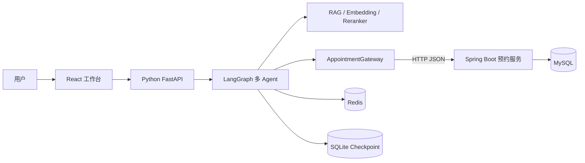

# Java 预约服务简历增强版改进计划

## 1. 改造目标

在保留 Python 大模型应用为项目主体的前提下，新增一个轻量的 Spring Boot 预约服务，将确定性的预约交易逻辑从 AI Agent 中解耦出来。

改造后的项目定位：

> Python FastAPI + LangGraph 负责意图识别、多轮对话、RAG 和任务编排；Java Spring Boot 负责技师查询、档期校验、预约创建以及并发一致性。

预期技术占比约为：

- Python / AI 工程：80%
- Java 业务后端：20%

本次改造的重点不是追求复杂微服务架构，而是用一个边界清晰、可以运行和测试的 Java 服务补充 Spring Boot、数据库事务、幂等和并发控制能力。

## 2. 当前系统与改造动机

当前预约流程主要由以下 Python 模块完成：

- `agents/appointment/technician_finder.py`：查找技师并判断档期
- `agents/appointment/appointment_processor.py`：处理预约确认与保存
- `services/appointment_service.py`：执行可用性检查、Redis 加锁和排班写入
- `db/models.py`：使用 `TechnicianSchedule` 同时表达排班和预约占用

当前实现已经具备 Redis 锁和幂等键，但仍有以下可提升点：

1. AI 编排逻辑与数据库交易逻辑耦合，Agent 会直接触发本地数据库写入。
2. 没有独立的预约实体，预约通过 `busy` 排班和 `appointment_id` 间接表达。
3. 幂等记录主要依赖 Redis，缺少数据库唯一约束作为最终防线。
4. 预约冲突依赖“先查询、再写入”的应用层流程，数据库层缺少强约束。
5. Python AI 服务同时承担模型调用、对话状态和预约交易，服务职责偏多。

## 3. 改造范围

### 3.1 本期实现

- 新增独立的 `backend-java` Spring Boot 工程
- 技师列表与详情查询
- 指定时间范围内的可用技师查询
- 创建预约
- 重复请求幂等处理
- 同一技师同一时间段的并发冲突控制
- 统一参数校验和异常响应
- Flyway 数据库版本管理
- Java 单元测试与数据库集成测试
- Python 预约网关抽象
- Python 通过 HTTP 调用 Java 服务
- 保留本地 Python 预约实现作为可配置回退
- Docker Compose 联合启动 Python、Java、数据库和 Redis
- README 架构及启动说明更新

### 3.2 本期不实现

- 不重写 FastAPI、LangGraph、RAG 和知识库模块
- 不迁移 LangGraph Checkpoint 和 Embedding 数据
- 不引入 Spring Cloud、注册中心或独立 API 网关
- 不拆分多个 Java 微服务
- 不接入真实支付、短信或邮件服务
- 不引入 Kafka、RabbitMQ 等消息中间件
- 不实现复杂会员、营销和积分系统
- 不为了技术数量引入不参与核心链路的组件

## 4. 目标架构



服务职责：

| 服务 | 负责内容 | 不负责内容 |
|---|---|---|
| Python AI 服务 | 意图分类、参数提取、多轮对话、RAG、回复生成、工具编排 | 预约事务和最终冲突裁决 |
| Java 预约服务 | 技师查询、可用性计算、预约事务、幂等、冲突控制 | 自然语言理解和大模型调用 |
| MySQL | 技师、预约、预约时间片等业务事实数据 | 对话和向量数据 |
| Redis | 可选的短期幂等缓存、分布式协调 | 业务事实的唯一来源 |

## 5. Java 技术方案

### 5.1 技术栈

- Java 21
- Spring Boot 3.x
- Spring Web
- Spring Validation
- Spring Data JPA
- MySQL 8
- Flyway
- Redis / Redisson（可选阶段接入）
- springdoc-openapi
- JUnit 5
- Testcontainers
- Maven

预约写入阶段优先通过数据库事务和唯一约束保证正确性。Redis 锁只能作为降低热点竞争的优化，不能作为预约不重复的唯一保障。

### 5.2 建议目录

```text
backend-java/
├── pom.xml
├── Dockerfile
└── src/
    ├── main/
    │   ├── java/.../appointment/
    │   │   ├── controller/
    │   │   ├── service/
    │   │   ├── repository/
    │   │   ├── entity/
    │   │   ├── dto/
    │   │   ├── exception/
    │   │   └── config/
    │   └── resources/
    │       ├── application.yml
    │       └── db/migration/
    └── test/
```

保持单体分层结构，不为当前规模引入 DDD 多模块或微服务基础设施。

## 6. 数据模型

### 6.1 `technician`

| 字段 | 类型 | 说明 |
|---|---|---|
| id | BIGINT | 主键 |
| name | VARCHAR | 技师姓名，唯一 |
| gender | VARCHAR | 性别 |
| strength | VARCHAR | 擅长项目 |
| enabled | BOOLEAN | 是否可预约 |
| created_at | DATETIME | 创建时间 |
| updated_at | DATETIME | 更新时间 |

### 6.2 `appointment`

| 字段 | 类型 | 说明 |
|---|---|---|
| id | BIGINT | 主键 |
| appointment_no | VARCHAR | 对外预约编号，唯一 |
| user_id | VARCHAR | 用户标识 |
| session_id | VARCHAR | AI 会话标识 |
| technician_id | BIGINT | 技师 ID |
| service_name | VARCHAR | 服务项目 |
| start_time | DATETIME | 开始时间 |
| end_time | DATETIME | 结束时间 |
| status | VARCHAR | `CONFIRMED`、`CANCELED`、`COMPLETED` |
| idempotency_key | VARCHAR | 请求幂等键，唯一 |
| created_at | DATETIME | 创建时间 |
| updated_at | DATETIME | 更新时间 |

### 6.3 `appointment_slot`

将预约时段标准化为固定粒度的时间片，例如 30 分钟：

| 字段 | 类型 | 说明 |
|---|---|---|
| id | BIGINT | 主键 |
| appointment_id | BIGINT | 预约 ID |
| technician_id | BIGINT | 技师 ID |
| slot_start | DATETIME | 时间片开始时间 |

建立唯一索引：

```sql
UNIQUE KEY uk_technician_slot (technician_id, slot_start)
```

创建 60 分钟预约时，在同一事务中写入两个 30 分钟时间片。并发请求争抢同一技师时间片时，由数据库唯一约束保证最多一个请求成功。

## 7. API 契约

### 7.1 查询技师

```http
GET /internal/v1/technicians
GET /internal/v1/technicians/{id}
```

### 7.2 查询可用技师

```http
GET /internal/v1/technicians/available
    ?startTime=2026-08-24T14:00:00
    &durationMinutes=60
    &gender=女
    &strength=肩颈按摩
```

### 7.3 创建预约

```http
POST /internal/v1/appointments
Idempotency-Key: <session-id>-<request-id>
Content-Type: application/json
```

```json
{
  "userId": "default_user",
  "sessionId": "session-123",
  "technicianId": 1,
  "serviceName": "肩颈按摩",
  "startTime": "2026-08-24T14:00:00",
  "durationMinutes": 60
}
```

成功响应：

```json
{
  "code": "OK",
  "message": "预约成功",
  "data": {
    "appointmentNo": "APT202608240001",
    "status": "CONFIRMED"
  }
}
```

冲突响应使用 HTTP `409 Conflict`，错误码为 `APPOINTMENT_SLOT_CONFLICT`。重复幂等请求返回首次请求对应的预约结果，不重复写库。

## 8. Python 集成方案

### 8.1 预约网关

新增统一协议，隔离 Agent 与具体存储方式：

```text
services/appointment_gateway/
├── base.py
├── local_gateway.py
├── java_gateway.py
└── factory.py
```

核心方法：

```python
class AppointmentGateway(Protocol):
    async def list_technicians(self) -> list[dict]: ...
    async def find_available_technicians(self, request: dict) -> list[dict]: ...
    async def create_appointment(self, request: dict, idempotency_key: str) -> dict: ...
```

实现方式：

- `LocalAppointmentGateway`：复用现有 SQLAlchemy 预约逻辑，保证开发回退能力
- `JavaAppointmentGateway`：使用异步 HTTP 客户端调用 Spring Boot
- `factory.py`：根据环境变量选择实现

建议配置：

```env
APPOINTMENT_BACKEND=java
JAVA_APPOINTMENT_BASE_URL=http://appointment-service:8080
JAVA_APPOINTMENT_TIMEOUT_SECONDS=3
```

### 8.2 Agent 调整

只调整确定性业务调用点：

1. `technician_finder.py` 通过网关查询技师和档期。
2. `appointment_processor.py` 在用户确认后通过网关创建预约。
3. Java 返回冲突时，Agent 回到推荐其他技师或时间的对话流程。
4. LangGraph 路由、Structured Output 和回复生成保持不变。

不允许 Python 和 Java 同时写入同一份预约数据；启用 Java 后端时，Java 服务是预约数据唯一写入方。

## 9. 实施阶段

### 阶段一：Java 服务骨架与只读能力

- [x] 创建 `backend-java` Maven 工程
- [x] 配置 Spring Boot、JPA、Validation 和 Flyway
- [x] 创建 MySQL Compose 服务
- [x] 编写技师表和初始化迁移
- [x] 完成技师列表、详情和可用性查询接口
- [x] 生成 OpenAPI 文档
- [x] 完成 Repository 与 Controller 测试

验收结果：Java 服务可以独立启动，Swagger 中可查询技师和可预约时间。

阶段一实施记录（2026-08-23）：

- Java 21 + Spring Boot 3.3.5 工程已落在 `backend-java/`。
- Flyway `V1` 迁移创建 `technician`、`technician_schedule` 并初始化 10 位演示技师。
- 已实现技师列表、详情和带性别/专长过滤的指定时段可用性接口。
- 已提供 Swagger UI、OpenAPI JSON 和 Actuator 健康检查。
- Compose 已增加 `appointment-service`、MySQL 8.4、健康检查和持久化卷。
- Maven `package` 构建通过：9 个测试全部通过，其中包含 Repository、Controller、Service 以及随机端口启动/OpenAPI 冒烟测试。
- 已在 Docker Desktop 中完成 MySQL 8.4 与 Java 服务的镜像构建和容器联调；MySQL、Java 服务健康检查均通过，Flyway `V1` 迁移成功执行，三个只读接口与 OpenAPI 文档均已实际验证。
- 为避免与本机已有 MySQL 的 `3306` 端口冲突，容器默认映射到宿主机 `127.0.0.1:3307`，容器网络内仍使用 `3306`。

### 阶段二：预约事务、幂等和冲突控制

- [x] 创建预约表与预约时间片表
- [x] 实现预约创建事务
- [x] 使用唯一时间片约束防止重叠预约
- [x] 使用 `idempotency_key` 唯一索引处理重复提交
- [x] 实现统一异常处理与 `409 Conflict`
- [x] 编写并发预约集成测试
- [x] 使用 Testcontainers 验证真实 MySQL 行为

验收结果：多个并发请求预约同一技师同一时间段时，只有一个预约成功；重复幂等请求只生成一条预约记录。

阶段二实施记录（2026-08-23）：

- Flyway `V2` 迁移创建 `appointment` 与 `appointment_slot`，并为预约编号、幂等键和 `(technician_id, slot_start)` 建立唯一约束。
- 已实现 `POST /internal/v1/appointments`：首次创建返回 `201`，同一幂等键重放返回原预约和 `200`，不会重复写库。
- 预约时长按 30 分钟拆分为时间片，并要求开始时间对齐整点或半点；Spring 事务保证预约主记录与全部时间片同时提交或回滚。
- 不同请求抢占同一技师的重叠时段时，由 MySQL 唯一时间片约束裁决，统一返回 `409 Conflict` 和 `APPOINTMENT_SLOT_CONFLICT`。
- 技师可用性查询已同时排除原有忙碌排班和 Java 服务中状态为 `CONFIRMED` 的预约，创建后的时段可立即反映在查询结果中。
- Java 完整测试共 19 个，全部通过；其中 4 个 Testcontainers 集成测试使用真实 MySQL 8.4，覆盖不同幂等键并发冲突、同键并发重放、相邻时段成功和失败事务回滚。
- 已对持久化 Compose 环境完成 Flyway `V1` 到 `V2` 升级与真实 API 联调：首次创建 `201`、同键重放 `200` 且预约号一致、换键抢占同一时段 `409`，已预约技师从该时段可用列表中排除。
- 当前 React/FastAPI 仍未调用 Java 创建接口，聊天入口的切换属于阶段三；本阶段可通过 Swagger UI 独立演示 Java 后端能力。

### 阶段三：Python Agent 接入

- [x] 定义 `AppointmentGateway` 协议
- [x] 实现 `LocalAppointmentGateway`
- [x] 实现 `JavaAppointmentGateway`
- [x] 修改技师查找与预约保存调用点
- [x] 增加超时、连接失败和业务冲突映射
- [x] 保留环境变量回退开关
- [x] 增加 Python 契约测试和 Agent 回归测试

验收结果：用户通过原聊天页面完成预约，最终预约由 Java 服务写入；Java 服务不可用时返回清晰错误，不出现虚假“预约成功”。

阶段三实施记录（2026-08-23）：

- 新增异步 `AppointmentGateway` 协议及创建命令、预约结果和统一错误类型，Agent 不再依赖具体数据库实现。
- `LocalAppointmentGateway` 复用原有 `AppointmentService` 与 SQLite，作为本地开发和配置回退能力；`JavaAppointmentGateway` 使用 `aiohttp` 调用 Spring Boot 的技师、档期和创建预约接口。
- `AppointmentAgent` 为技师查找与预约保存注入同一个网关，确保 Java 模式下查询和写入使用同一事实源，不出现“查询 MySQL、写入 SQLite”的混合链路。
- 使用 `APPOINTMENT_BACKEND=local|java` 切换实现，并提供 Java 地址与 3 秒超时配置；Java 故障不会自动回退写本地数据库，避免双写和数据不一致。
- Python 会根据会话、技师和时间生成稳定的 SHA-256 幂等键，并透传到 Java 的 `Idempotency-Key` 请求头。
- Java `409` 被映射为“时段刚被其他用户预约”，超时/连接失败被映射为“本次没有创建预约”，参数错误会提示整点/半点和 30 分钟粒度规则；所有失败场景都不会输出虚假成功。
- 写入冲突或后端故障后，Agent 会保留用户已填写的预约信息且不标记流程完成，用户可以直接更换时间或重试。
- 新增 8 个 Python 网关契约与 Agent 回归测试；项目完整离线回归结果为 `98 passed, 15 skipped`，跳过项均为显式在线模型测试。
- 已完成真实 Python → Java → MySQL 联调：通过 `JavaAppointmentGateway` 创建预约、同键重放未新增记录、预约号一致，创建后对应技师从该时段可用列表中排除。
- 联调生成的演示预约号为 `APT2031050613CF02A304F3`，时间为 `2031-05-06 14:00`，技师 ID 为 `1`。
- 当前源码与宿主机联调已验收；运行中的 Python Docker 容器仍是阶段三改造前的镜像。完整镜像重建、Compose 一键启动和前端聊天演示统一放在阶段四完成。

### 阶段四：部署、观测与文档

- [x] 更新 Docker Compose，加入 Java 和 MySQL
- [x] 为 Python、Java 增加健康检查
- [x] 在请求中透传 `session_id` 或 `trace_id`
- [x] Java 日志记录预约号、会话 ID 和冲突原因
- [x] 更新 README 技术栈和架构图
- [x] 补充本地启动、测试和故障演示步骤
- [x] 更新系统功能与面试问答文档

验收结果：一条命令可以启动完整系统，README 可以复现正常预约、重复请求和并发冲突场景。

阶段四实施记录（2026-08-23）：

- Compose 已统一编排 Python App、Java 预约服务、MySQL 8.4 和 Redis 7，并为 SQLite、MySQL、Redis 配置持久化卷；四个容器均通过健康检查。
- Python 默认使用 `APPOINTMENT_BACKEND=java`，容器内通过服务名访问 Java；Python 和 Java 均提供健康接口，启动依赖以健康状态为准。
- Python 为每次预约创建调用生成并透传 `X-Trace-Id`，同时在请求体传递 `session_id`；Java 将 trace ID 原样写入响应头和日志，便于跨服务定位。
- Java 日志已区分 `created`、`replayed` 和 `conflict`，并记录 trace ID、会话 ID、技师 ID、预约号或冲突原因。
- 根 README 已更新技术栈、架构图、服务职责、Compose 启动方式和测试基线；新增 `JAVA_APPOINTMENT_OPERATIONS_AND_DEMO.md`，覆盖 Swagger、幂等、冲突、日志和故障恢复演示。
- Python 镜像改为从 PyTorch 官方 CPU wheel 源安装 `torch 2.6.0+cpu`，验证 `cudaAvailable=false`，避免在无 GPU 的服务镜像中下载 CUDA 运行库；当前应用镜像约 522 MiB，并启用 BuildKit pip 缓存。
- GitHub Actions 已增加 Java 21 + Maven + MySQL Testcontainers 测试，并分别构建 Python 和 Java 两个 Docker 镜像。
- 完整回归结果：Python `98 passed, 15 skipped`；Java `19 passed`，其中 4 条使用真实 MySQL 8.4 Testcontainers。
- 已从重建后的 Python 容器完成 Python → Java → MySQL 实链路验收：首次创建、同键重放、换键冲突和档期排除均符合预期；演示预约号为 `APT20320607F4E74E8860EA`。
- 已实际停止 Java 服务进行故障演练：Agent 明确提示后端暂不可用和“本次没有创建预约”，不会输出虚假成功；Java 恢复后四个容器重新回到健康状态。

### 可选阶段：Redis / Redisson

- [ ] 对热点技师增加短时 Redisson 锁
- [ ] 缓存技师基础信息或短期可用性查询
- [ ] 验证 Redis 不可用时数据库约束仍能保证预约正确性

该阶段只作为性能优化，不作为核心正确性前置条件。

## 10. 测试计划

### Java 测试

- 技师不存在时返回 `404`
- 开始时间早于当前时间时返回 `400`
- 时长不是允许粒度时返回 `400`
- 正常创建预约并生成完整时间片
- 同一幂等键重复请求返回同一预约
- 同一技师同一时间段并发预约只有一个成功
- 相邻但不重叠的时间段可以预约
- 事务中任一时间片写入失败时全部回滚

### Python 测试

- 网关工厂能正确切换本地和 Java 实现
- Java 请求 DTO 与响应 DTO 映射正确
- 超时和连接失败不会被包装成预约成功
- Java 返回 `409` 后 Agent 能提示时间冲突
- 现有 LangGraph 多轮预约流程继续通过
- RAG、咨询和知识库测试不受影响

### 端到端验收场景

1. 用户提出预约意图并逐轮补全信息。
2. Python Agent 查询 Java 获取可用技师。
3. 用户确认后 Java 创建预约。
4. 再次发送相同请求，返回原预约结果。
5. 另一个会话抢占同一时间段，收到冲突提示。
6. 用户改选其他技师或时间后预约成功。

## 11. 完成标准

只有同时满足以下条件才认为简历增强版完成：

- Python 仍是对外 AI 主服务和 Agent 编排入口
- Java 服务独立运行并拥有清晰的数据边界
- 正常预约链路通过 Java 服务完成
- 数据库约束可以阻止重叠预约
- 幂等请求不会产生重复预约
- 并发行为有自动化集成测试证明
- Java 服务故障不会产生虚假预约成功消息
- 原有 RAG 和非预约 Agent 回归测试通过
- Docker Compose 和 README 可以复现完整链路
- 架构设计与实际代码一致，不只停留在文档描述

## 12. 简历表述建议

项目描述建议继续突出 Python 大模型方向：

> 基于 FastAPI、LangGraph 与 Hybrid RAG 构建智能预约多 Agent 系统，实现意图路由、多轮预约、知识检索、重排与可观测评测。

Java 增强点可以表述为：

> 将预约交易从概率性的 Agent 流程中解耦为 Spring Boot 领域服务，Python Agent 通过工具接口调用 Java 服务，由 Java 负责技师档期、预约事务和最终业务校验。

> 基于 MySQL 唯一时间片约束、Spring 事务及请求幂等键处理并发预约冲突，通过 Testcontainers 构造真实数据库并发测试，保证同一技师同一时段最多生成一笔有效预约。

> 设计本地 Python 与远程 Java 双实现的 AppointmentGateway，通过配置切换后端并统一超时、冲突和降级语义，降低 Agent 编排层对业务存储的耦合。

表述时应以实际完成的代码和测试为准；未实现的 Redisson、消息队列或微服务治理能力不写入简历。

## 13. 面试讲解主线

1. **为什么拆分**：LLM 输出具有概率性，核心预约交易需要确定性的校验、事务和数据库约束。
2. **为什么保留 Python**：LangGraph、RAG、Embedding 和模型评测更适合 Python 生态，也是项目的主要方向。
3. **为什么使用 Java**：预约、排班和并发一致性属于传统业务后端，Spring Boot 能清晰展示事务、分层和工程化能力。
4. **如何防止重复预约**：幂等键解决重复提交，唯一时间片约束解决不同请求争抢同一资源，两者解决的问题不同。
5. **Redis 是否必要**：Redis 可以减少热点竞争，但最终正确性由数据库事务和唯一约束保证。
6. **如何避免分布式数据混乱**：Java 独占预约数据写权限，Python 只通过 API 调用，不进行双写。

## 14. 预估工作量

| 阶段 | 预估时间 |
|---|---:|
| Java 骨架、数据库和查询接口 | 1 天 |
| 预约事务、幂等和并发测试 | 1～2 天 |
| Python 网关适配和回归测试 | 1 天 |
| Compose、文档和演示整理 | 1 天 |

基础可运行版本预计 2～3 天；达到适合写入简历、具备完整测试和文档的版本预计 4～5 天。
